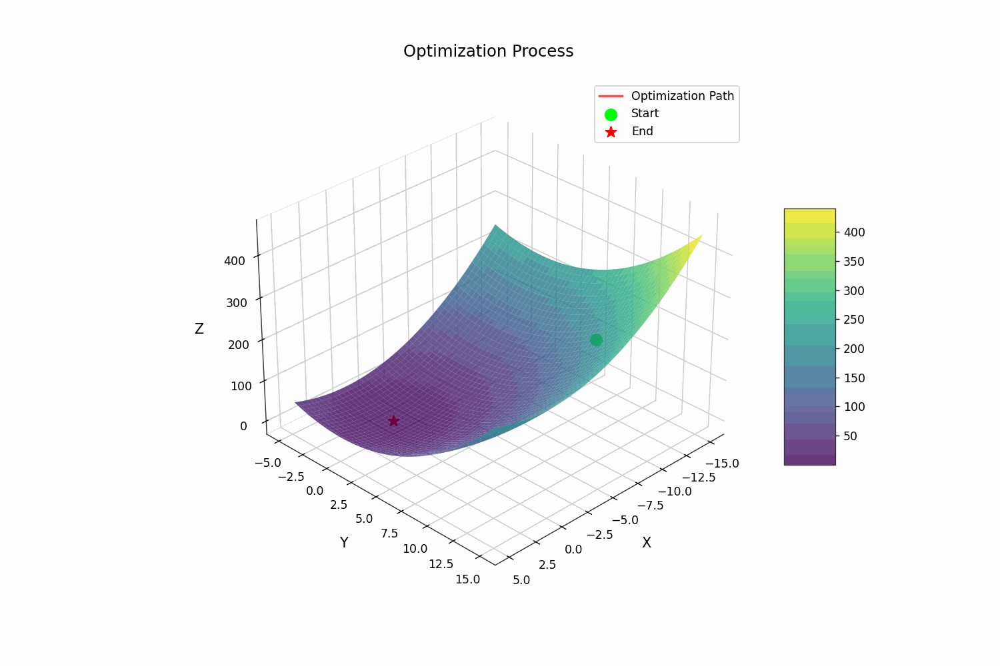

# MicroGrad3D

MicroGrad3D is a lightweight autograd engine with 3D visualization support, featuring various optimization algorithms including Natural Gradient Descent and second-order derivatives.





## Features

- **Automatic Differentiation**
  - First-order and second-order derivatives
  - Supports basic mathematical operations
  - Efficient computation graph

- **Rich Optimization Algorithms**
  - Gradient Descent
  - Momentum
  - AdaGrad
  - RMSprop
  - Adam
  - Newton's Method
  - Natural Gradient Descent
  - L-BFGS

- **3D Visualization**
  - Real-time optimization process visualization
  - Customizable plot styles
  - Animation support
  - Interactive 3D surface plots


## Quick Start
```python
from micrograd3d import Value, square, Visualizer3D
from micrograd3d.optimizer import Adam

# Define your function
def func(x, y):
    return x**2 + y**2

# Create visualizer instance
viz = Visualizer3D(
    func=func,
    optimizer=Adam(learning_rate=0.1),
    n_steps=200,
    window_size=5
)

# Run optimization and create animation
anim = viz.optimize_and_plot(start_point=(-10.0, 10.0))

plt.show()
```


## Advanced Usage

### Using Different Optimizers

```python
from micrograd3d.optimizer import GradientDescent,Momentum,AdaGrad,RMSprop,Adam,NewtonMethod,NaturalGradient,LBFGS


#Standard gradient descent
optimizer = GradientDescent(learning_rate=0.1)

#Momentum
optimizer = Momentum(learning_rate=0.1, momentum=0.9)

#AdaGrad
optimizer = AdaGrad(learning_rate=0.1)

#RMSprop
optimizer = RMSprop(learning_rate=0.1, decay=0.9)

#Adam
optimizer = Adam(learning_rate=0.1)

#Newton's Method
optimizer = NewtonMethod(learning_rate=0.1)

#Natural Gradient Descent
optimizer = NaturalGradient(learning_rate=0.1, damping=1e-4)

#LBFGS
optimizer = LBFGS(learning_rate=0.1)
```


### Custom Objective Functions

```python
from micrograd3d import Value, Visualizer3D
from micrograd3d.optimizer import Adam

def custom_function(x, y):
    return x**2 + y**2 + x*y + x + y

viz = Visualizer3D(
    func=custom_function,
    optimizer=Adam(learning_rate=0.1),
    n_steps=200,
    window_size=5
)
```


### Saving Animations

```python
anim = viz.optimize_and_plot(start_point=(-10.0, 10.0))

# Save animation as GIF
writer = PillowWriter(fps=30)
anim.save('optimization.gif', writer=writer)
```


## Contributing

Contributions are welcome! Please feel free to submit a Pull Request.

1. Fork the repository
2. Create your feature branch (`git checkout -b feature/AmazingFeature`)
3. Commit your changes (`git commit -m 'Add some AmazingFeature'`)
4. Push to the branch (`git push origin feature/AmazingFeature`)
5. Open a Pull Request

## License

This project is licensed under the MIT License - see the [LICENSE](LICENSE) file for details.


## Author

- GitHub: [@meditator706](https://github.com/meditator706)
